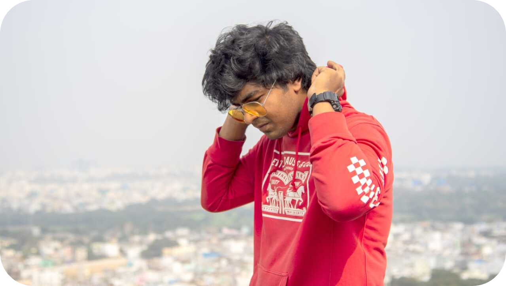
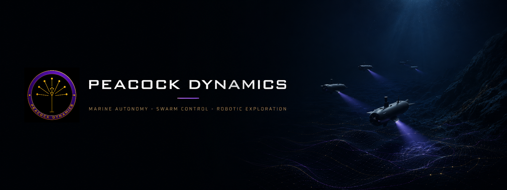
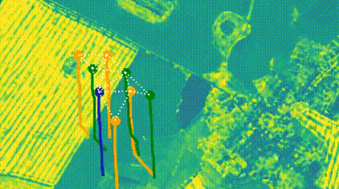
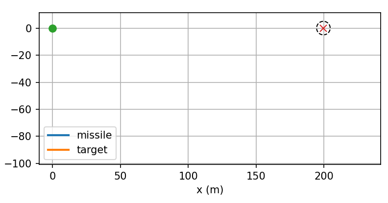
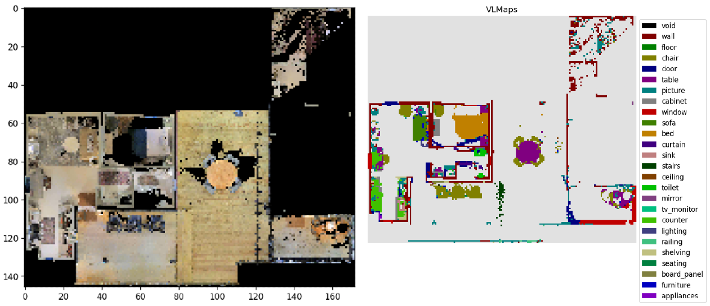

## **AYUSHMAN MISHRA (आयुष्मान् मिश्र)**

### Robotics, Autonomous Systems, Controls, Perception,  
### Reinforcement Learning, and Swarm Intelligence.
\
**Sovereignty. Singularity. Control.**  
**संप्रभुता। एकत्व। नियंत्रण।**

**Email-ID**: aymisxx@proton.me  
**LinkedIn:** https://linkedin.com/in/aymisxx  
**GitHub:** https://github.com/aymisxx  

---

## About Me

I am a robotics and control systems engineer working at the intersection of **autonomy**, **multi-robot coordination**, **reinforcement learning**, and **machine perception**.

My work explores how classical control theory and modern machine learning can combine to build autonomous systems that are **interpretable**, **reliable**, **measurable**, and honest about their limits.

I design lightweight experimental platforms and simulation environments to study **navigation**, **coordination**, and **decision-making** in robotic systems.

Beyond formal showcase work, I enjoy experimenting with autonomous agents in unconventional environments, from ultra-lightweight drone simulators to reinforcement-learning bots in classic open-source game engines such as **Doom** and **Quake III Arena**. These sandboxes help me test ideas in autonomy, control, and learning beyond conventional robotics setups.

If you are working on interesting ideas in robotics, autonomy, intelligent systems, or unconventional autonomy experiments, feel free to reach out.

------------------------------------------------------------------------

# Peacock Dynamics

**Peacock Dynamics** is an independent robotics research group focused on **marine swarm autonomy**, **simulation-tested coordination algorithms**, and **control-aware multi-robot exploration**.

The group develops algorithmic foundations for coordinated robotic systems that can operate in difficult marine environments, where communication is limited, dynamics are uncertain, sensing is imperfect, and continuous human supervision is not always possible.

The current mission is to build and evaluate autonomy stacks for **distributed marine exploration**, including seabed mapping, environmental sensing, coverage planning, guidance, perception, task allocation, and communication-aware swarm behavior.

This work follows an **algorithm-first** approach:

**model → simulate → control → coordinate → evaluate → translate toward deployment**

## Research Directions

- **Marine Swarm Autonomy.**
- **Multi-Robot Coordination.**
- **Coverage, Guidance & Task Allocation.**
- **Communication-Constrained Cooperation.**
- **Simulation-First Robotics.**
- **Control-Aware Autonomy.**
- **Perception & Environmental Mapping.**
- **ROS2/Gazebo-Based Robotic Prototyping.**

## Technical Lineage

Peacock Dynamics builds on prior work across aerial, terrestrial, planetary, and simulation-based robotics, including reinforcement-learning navigation, swarm coordination, optimal control, robotic perception, 3D reconstruction, and PX4/ROS2 autonomy.

These earlier systems now form the technical foundation for adapting autonomy research toward future marine robotic exploration.

**Website:** https://peacockdynamics.github.io  
**GitHub Organization:** https://github.com/PeacockDynamics  
**LinkedIn:** https://linkedin.com/company/peacockdynamics  

------------------------------------------------------------------------

# Featured Work

A selected set of robotics projects across **swarm autonomy**, **UAV systems**, **robot perception**, **3D reconstruction**, **guidance/control**, **semantic mapping**, and **manipulation**.

| Domain | Featured Work | Repository |
|---|---|---|
| **Swarm Autonomy** | [PPO-Driven Swarm Control](#ppo-driven-swarm-control) | [GitHub Repository](https://github.com/aymisxx/PPO-driven-Swarm-Control) |
| **UAV Autonomy** | [TerraDrop-PX4](#terradrop-px4) | [GitHub Repository](https://github.com/aymisxx/TerraDrop-PX4) |
| **Robot Perception** | [Reflect-Aug-Seg](#reflect-aug-seg) | [GitHub Repository](https://github.com/aymisxx/reflect-aug-seg) |
| **3D Reconstruction** | [ApolloSplat-Py](#apollosplat-py) | [GitHub Repository](https://github.com/aymisxx/ApolloSplat-Py) |
| **Guidance & Control** | [interceptDynamics-Py](#interceptdynamics-py) | [GitHub Repository](https://github.com/aymisxx/interceptDynamics-Py) |
| **Semantic Mapping** | [VLMaps Reimplementation](#vlmaps-reimplementation) | [GitHub Repository](https://github.com/aymisxx/vlmaps-reimplementation) |
| **Manipulation** | [Color-Sorted Pick-and-Place in ROS](#color-sorted-pick-and-place-in-ros) | [GitHub Repository](https://github.com/aymisxx/color-sorted-pick-place-ros) |

---

## 1. PPO-Driven Swarm Control

  

Hybrid multi-robot coverage-control algorithm combining a learned PPO local navigation policy with classical swarm coordination layers.

The system mixes **PPO-based local navigation**, **artificial potential-field repulsion**, **graph-based directional consensus**, and **CRN-inspired stochastic roles** to study how learned policies can be made safer and more coherent in multi-agent coverage tasks.

**Core ideas:** PPO, swarm robotics, multi-agent coverage, repulsion, graph consensus, stochastic role allocation  
**Repository:** https://github.com/aymisxx/PPO-driven-Swarm-Control

[Back to Index](#project-index)

---

## 2. TerraDrop-PX4

Compact ROS2/Gazebo/PX4 autonomous drone setup for marker search, visual alignment, and precision landing.

The system uses **PX4 SITL**, **ROS2 offboard control**, **RGB camera input**, **ArUco detection**, image-plane alignment correction, and pinhole-camera range estimation to demonstrate perception-driven UAV autonomy.

**Core ideas:** ROS2, PX4, Gazebo, visual servoing, ArUco detection, offboard control, UAV autonomy  
**Repository:** https://github.com/aymisxx/TerraDrop-PX4

[Back to Index](#project-index)

---

## 3. Reflect-Aug-Seg

Reflectivity-augmented LiDAR scene-understanding framework studying whether lightweight range-aware transformations of LiDAR intensity improve semantic interpretability.

The study introduces pseudo-reflectivity features, analyzes SemanticKITTI signal behavior, evaluates class separability, studies temporal consistency, and documents where range-aware signal engineering helps or fails.

**Core ideas:** LiDAR perception, reflectivity proxies, SemanticKITTI, semantic separability, sensor signal analysis  
**Repository:** https://github.com/aymisxx/reflect-aug-seg

[Back to Index](#project-index)

---

## 4. ApolloSplat-Py

Photogrammetry and robotics asset pipeline reconstructing lunar terrain from Apollo 17 imagery.

The pipeline uses **COLMAP sparse SfM**, dense reconstruction, stereo fusion, mesh generation, diagnostics, and ROS2/RViz2 export to transform historical lunar images into a robotics-usable terrain asset.

**Core ideas:** COLMAP, photogrammetry, 3D reconstruction, lunar terrain, mesh export, ROS2 visualization  
**Repository:** https://github.com/aymisxx/ApolloSplat-Py

[Back to Index](#project-index)

---

## 5. interceptDynamics-Py

Clean 2D pursuit-evasion interception study comparing classical PD guidance against constrained MPC.

The simulator models relative-state dynamics, RK4 integration, maneuvering targets, acceleration limits, slew-rate constraints, proximity capture, and scenario-level evaluation through trajectory, distance, and control-activity plots.

**Core ideas:** MPC, PD guidance, pursuit-evasion, constrained control, interception dynamics, RK4 simulation  
**Repository:** https://github.com/aymisxx/interceptDynamics-Py

[Back to Index](#project-index)

---

## 6. VLMaps Reimplementation

Reimplementation of Visual Language Maps for language-conditioned robot navigation.

The work fuses **RGB-D observations**, **camera poses**, **geometric projection**, **LSeg/CLIP-style visual-language embeddings**, and top-down spatial maps so robots can ground free-form language queries into navigable indoor environments.

**Core ideas:** semantic mapping, visual-language navigation, RGB-D projection, CLIP/LSeg concepts, open-vocabulary robot navigation  
**Repository:** https://github.com/aymisxx/vlmaps-reimplementation

[Back to Index](#project-index)

---

## 7. Color-Sorted Pick-and-Place in ROS

ROS/Gazebo manipulation project for perception-driven sorting of colored blocks into matching bins.

The system uses **RGB-D sensing**, **HSV color segmentation**, contour extraction, centroid and bounding-box estimation, depth lookup, camera-intrinsics-based 2D-to-3D projection, homogeneous camera-to-world transforms, custom ROS messages, and a task-level finite-state machine for pick-and-place execution.

**Core ideas:** ROS, Gazebo, RGB-D perception, HSV segmentation, 2D-to-3D projection, manipulation, finite-state machines  
**Repository:** https://github.com/aymisxx/color-sorted-pick-place-ros

[Back to Index](#project-index)

---

# Broader Work Map

Additional work across robotics, control, learning, perception, and simulation.

## Robot Learning & Agentic Autonomy

- [PPO-Driven Swarm Control](https://github.com/aymisxx/PPO-driven-Swarm-Control)
- [AgriDroneRL](https://github.com/aymisxx/AgriDroneRL)
- [DriftCTRL](https://github.com/aymisxx/DriftCTRL)
- [SwarmNavigator](https://github.com/aymisxx/SwarmNavigator)
- [EventReflex-DroneNav](https://github.com/aymisxx/EventReflex-DroneNav)

## Control, Guidance & Dynamics

- [interceptDynamics-Py](https://github.com/aymisxx/interceptDynamics-Py)
- [VehicleLateralStability-Py](https://github.com/aymisxx/VehicleLateralStability-Py)
- [Cart-Pole Optimal Control using LQR](https://github.com/aymisxx/cart_pole_optimal_control)
- [Ultrasonic-PID-Motor-Control](https://github.com/aymisxx/Ultrasonic-PID-Motor-Control)
- [First-Order Boustrophedon Navigator](https://github.com/aymisxx/first_order_boustrophedon_navigator)

## Perception, Mapping & Semantics

- [Reflect-Aug-Seg](https://github.com/aymisxx/reflect-aug-seg)
- [VLMaps Reimplementation](https://github.com/aymisxx/vlmaps-reimplementation)
- [Color-Sorted Pick-and-Place in ROS](https://github.com/aymisxx/color-sorted-pick-place-ros)
- [Scan2Grid-TB3](https://github.com/aymisxx/Scan2Grid-TB3)
- [Label-Conditioned Robot Vision](https://github.com/aymisxx/Label-Conditioned-Robot-Vision)

## Reconstruction, Simulation & Deployment

- [ApolloSplat-Py](https://github.com/aymisxx/ApolloSplat-Py)
- [MicroUAV-2D](https://github.com/aymisxx/MicroUAV-2D)
- [TerraDrop-PX4](https://github.com/aymisxx/TerraDrop-PX4)
- [PacificPlateGaussianDrift](https://github.com/aymisxx/PacificPlateGaussianDrift)
- [Perceiver Architecture Study](https://github.com/aymisxx/Perceiver-Architecture-Study)

------------------------------------------------------------------------

# Technical Stack

**Robotics:** ROS1, ROS2, Gazebo, RViz, PX4, TurtleBot3.

**Control:** LQR, MPC, PID, Sliding Mode Control.

**ML/RL:** PyTorch, Stable-Baselines3, PPO, DQN, A2C.

**Vision:** OpenCV, RGB-D, LiDAR.

**Tools:** Linux, Git, COLMAP, MATLAB/Simulink.

------------------------------------------------------------------------

# My Engineering Philosophy & Methodology

My work usually follows a simulation-first engineering loop: start with the mathematical structure, build a controlled testbed, design the controller or policy, evaluate behavior quantitatively, visualize failure modes, and only then think about deployment.

**Mathematical Model**  
↓  
**Simulation**  
↓  
**Controller / Policy**  
↓  
**Evaluation**  
↓  
**Visualization**  
↓  
**Deployment**

I prefer systems that are:

- **Model-grounded**, not just demo-driven.
- **Measurable**, with clear metrics and failure cases.
- **Modular**, so perception, control, planning, and learning can be tested independently.
- **Honest**, because robotics breaks beautifully when assumptions are fake.

------------------------------------------------------------------------

**Sovereignty. Singularity. Control.**  
**संप्रभुता। एकत्व। नियंत्रण।**

------------------------------------------------------------------------